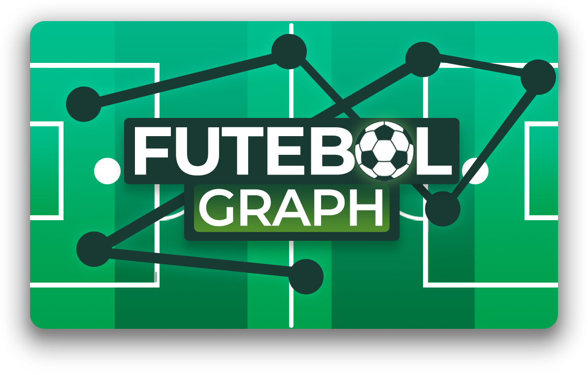

# FutebolGraph - Projeto Integrador 3B

| Alunos | Matrícula |
| ------ | ------ |
| Eduardo de Oliveira Alvim  | 2012130076 |
| Roger dos Santos de Alencar | 2022130015 |

## Informações

- Objetivo: Encontrar o menor caminho/melhor jogada possível para a bola chegar no jogador referência de um time de futebol.
- Documentação: [Link para a Documentação](https://drive.google.com/drive/folders/1cjjsdI5oYhP-FKLd2rZSsQbvXxbKuN2Q?usp=sharing)
- Apresentação: [Link para a Apresentação](https://www.canva.com/design/DAFTetccrvw/uWVEf9LFFrSJMPJLoCXD2g/view?utm_content=DAFTetccrvw&utm_campaign=designshare&utm_medium=link&utm_source=publishsharelink)
